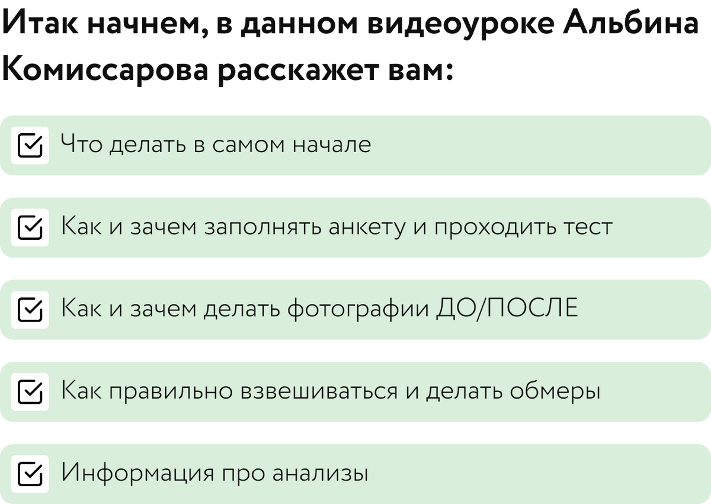

# Введение

Альбина Комиссарова рассказывает как подготовиться к работе

## Материалы урока

[Видео 01.mp4](Видео%2001.mp4)

Тайм-код

00:00 Приветствие 01:30 Что дальше? 01:50 Заполнение анкеты и шкалы пищевого поведения 04:32 Фотографии 06:16 Как правильно сделать фото? 07:23 Взвешивание и обмеры 09:09 Анализы

## Исходная страница

https://school.doctor-akomissarova.ru/pl/teach/control/lesson/view?id=339809687&editMode=0
