# Инструкция по созданию фото ДО и ПОСЛЕ

Задание №1

## Материалы урока

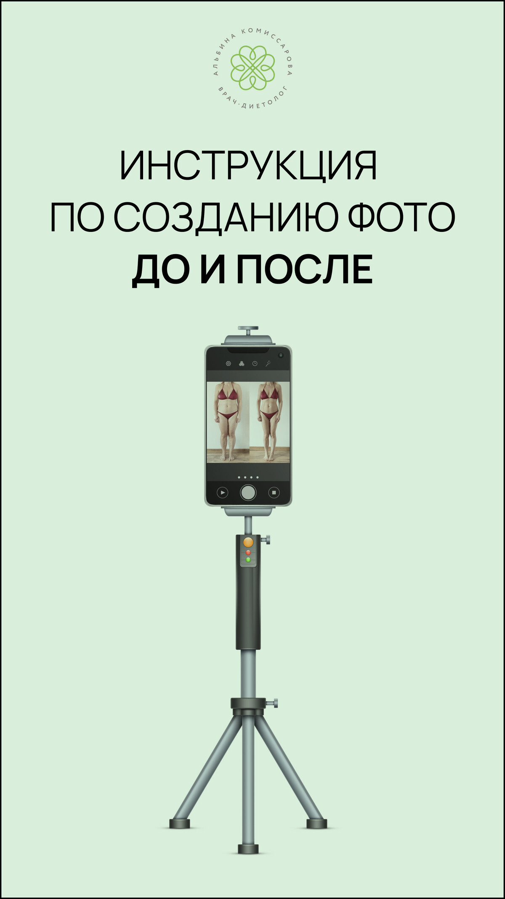

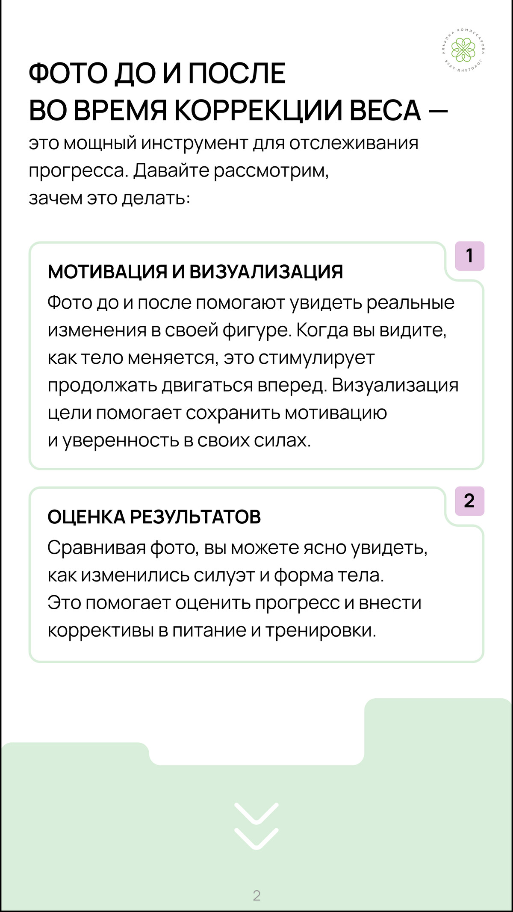

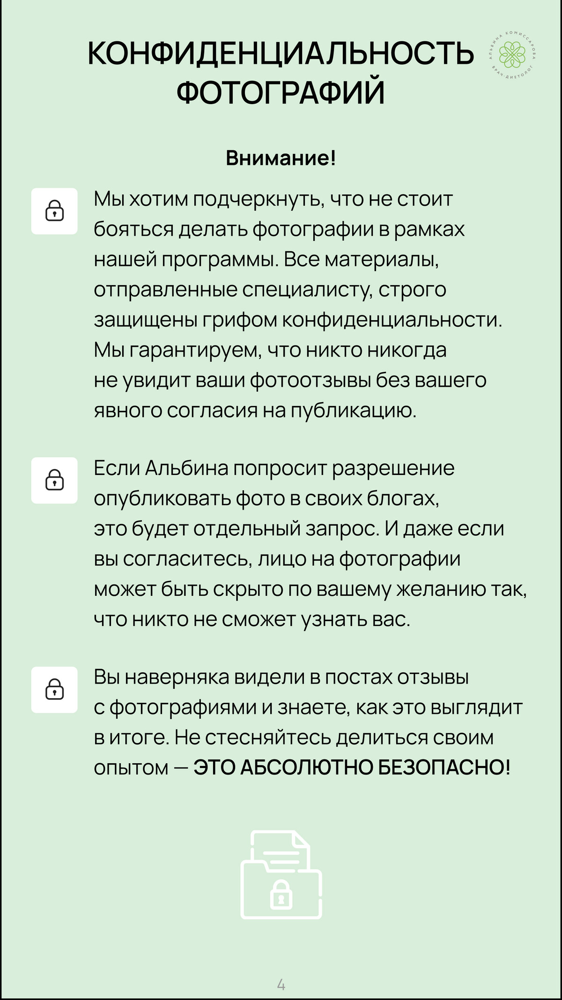

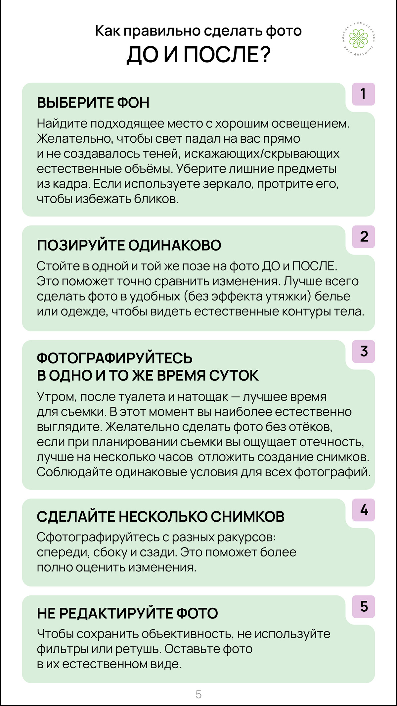

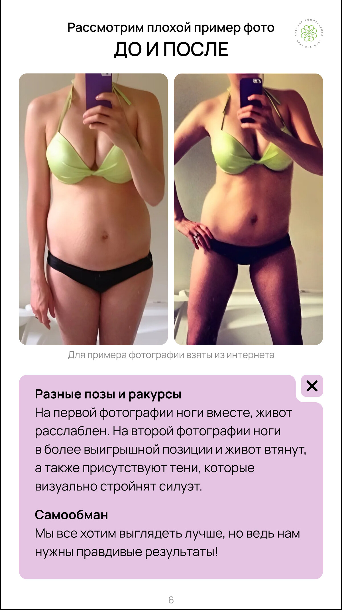

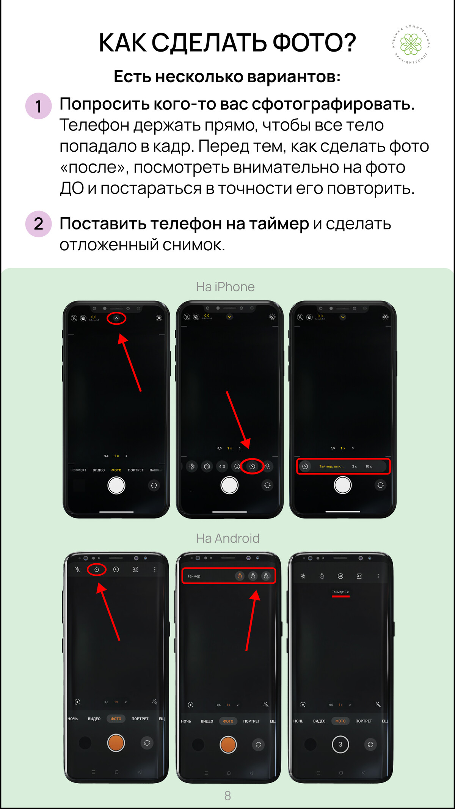

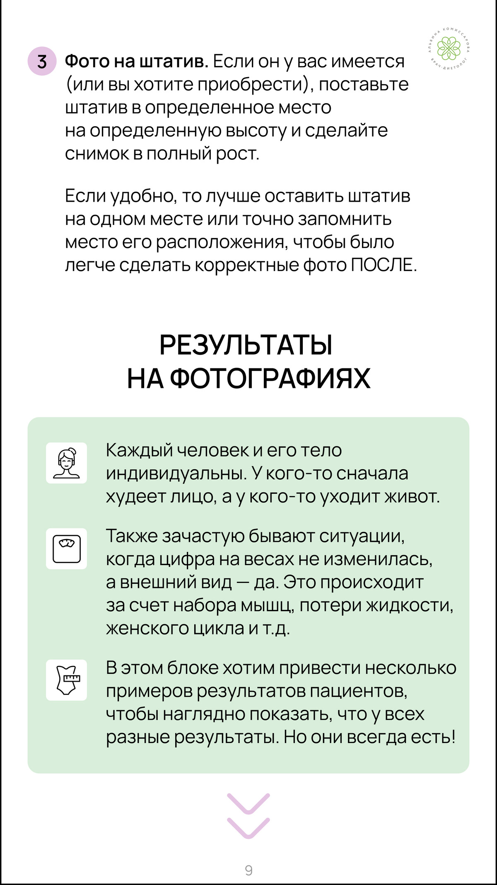

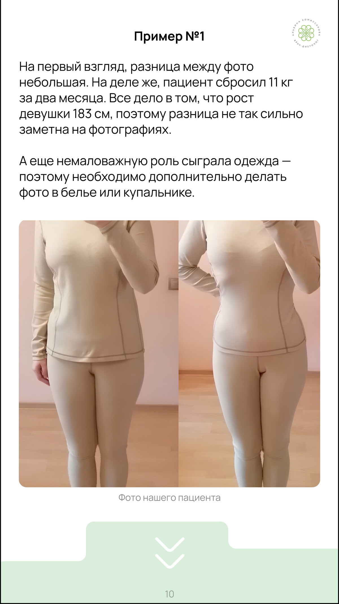

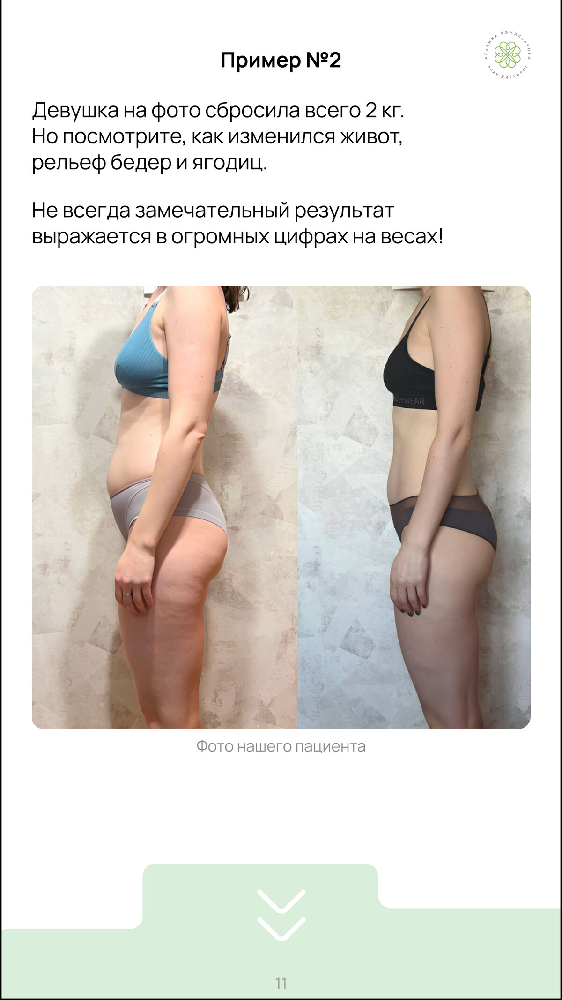

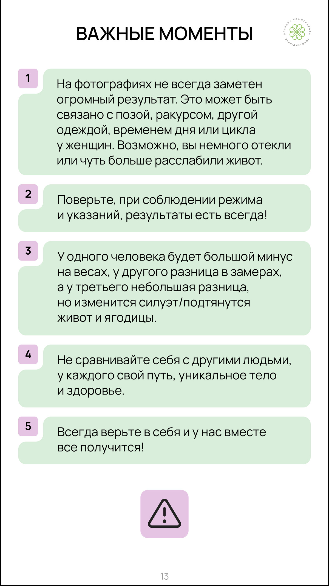

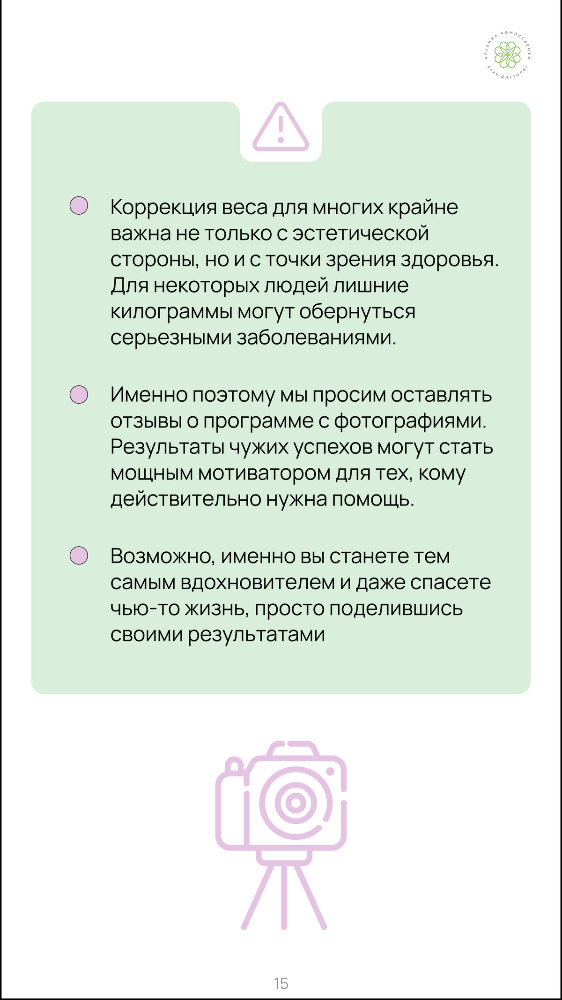

## Исходная страница

https://school.doctor-akomissarova.ru/pl/teach/control/lesson/view?id=339809397&editMode=0
