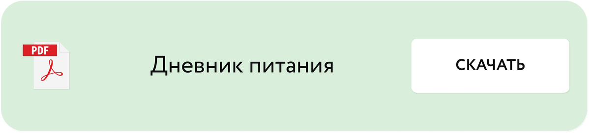

# Дневник питания и шкалы голода/насыщения

Автор: Альбина Комиссарова

## Материалы урока

[Видео 01.mp4](Видео%2001.mp4)

Тайм-код

00:00 Приветствие

01:28 Дневник питания. Зачем он нужен?

05:00 Как качественно и эффективно вести дневник питания?

08:45 Правила ведения дневника

11:32 Что еще важно при ведении дневника?

15:46 Что записывать в дневник?

17:55 Как оценивать дневник самостоятельно?

21:48 Методы изменений

24:38 Шкала голода/насыщения.

## Исходная страница

https://school.doctor-akomissarova.ru/pl/teach/control/lesson/view?id=339809408&editMode=0
