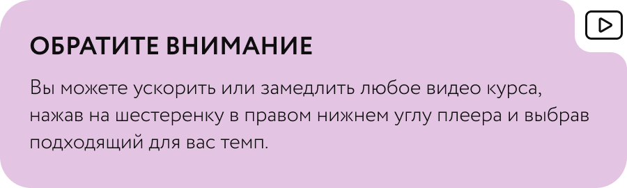

# Витамины и БАДы

Автор: Альбина Комиссарова

## Материалы урока

[Видео 01.mp4](Видео%2001.mp4)

Тайм-код

00:00 Приветствие

00:44 Поиск дефицитов. Нужно ли?

03:59 Что смотрим по анализам и зачем?

06:08 Что делать, если дефицит все-таки есть?

06:30 Про БАДы.

09:36 Можно или нет пить БАДы?

12:08 Витамин D

13:30 Омега-3

15:23 Кальций

16:19 Витамин С

## Исходная страница

https://school.doctor-akomissarova.ru/pl/teach/control/lesson/view?id=339809413&editMode=0
