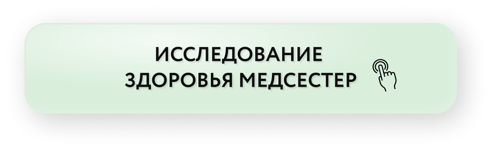
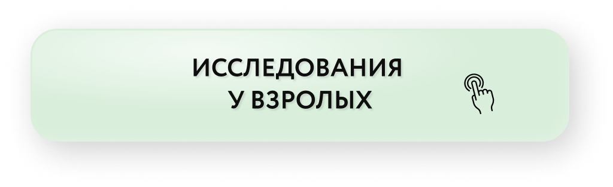
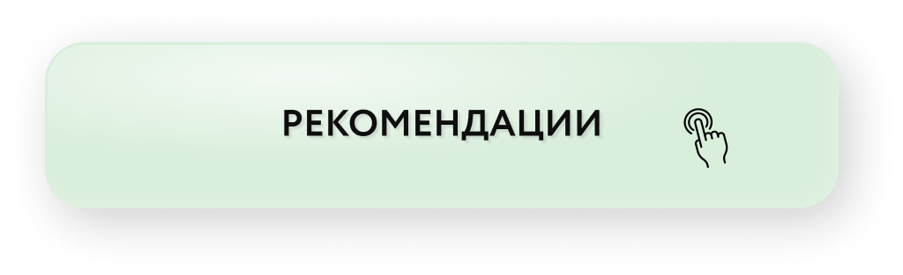

# Сон и стресс

Автор: Альбина Комиссарова

## Материалы урока

[Видео 01.mp4](Видео%2001.mp4)

Тайм-код

00:00 Приветствие

00:33 Зачем нам спать?

01:49 Последствия нарушений сна

02:36 Сон и масса тела

04:49 Как сон влияет на массу тела?

05:20 Сколько нужно спать?

06:00 Качество сна

07:12 Как улучшить качество сна?

11:47 Стресс. Заедание эмоций.

14:27 Как бороться с заеданием эмоций?

## Исходная страница

https://school.doctor-akomissarova.ru/pl/teach/control/lesson/view?id=339809415&editMode=0
