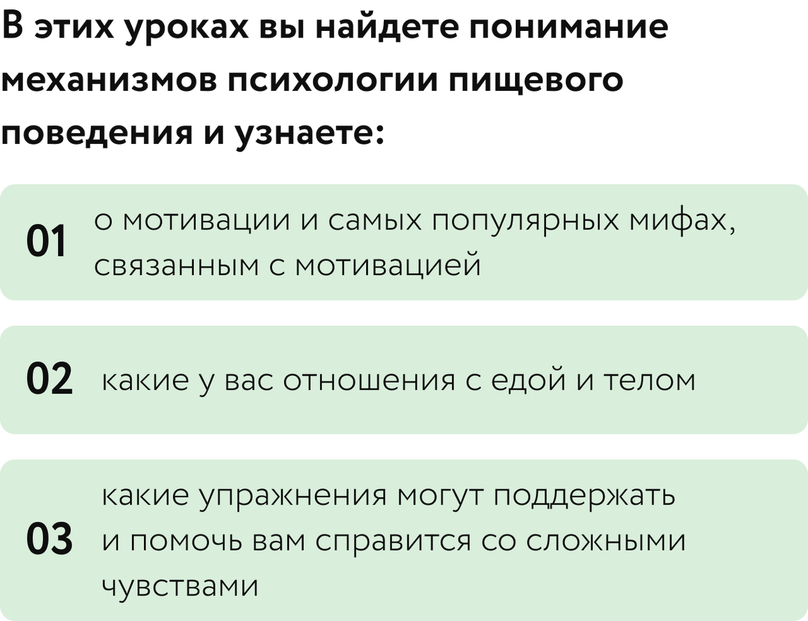
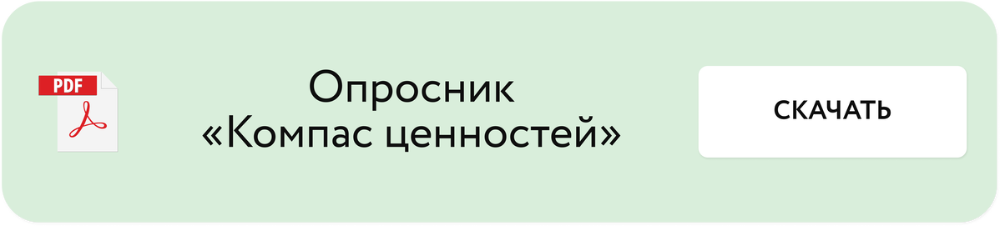
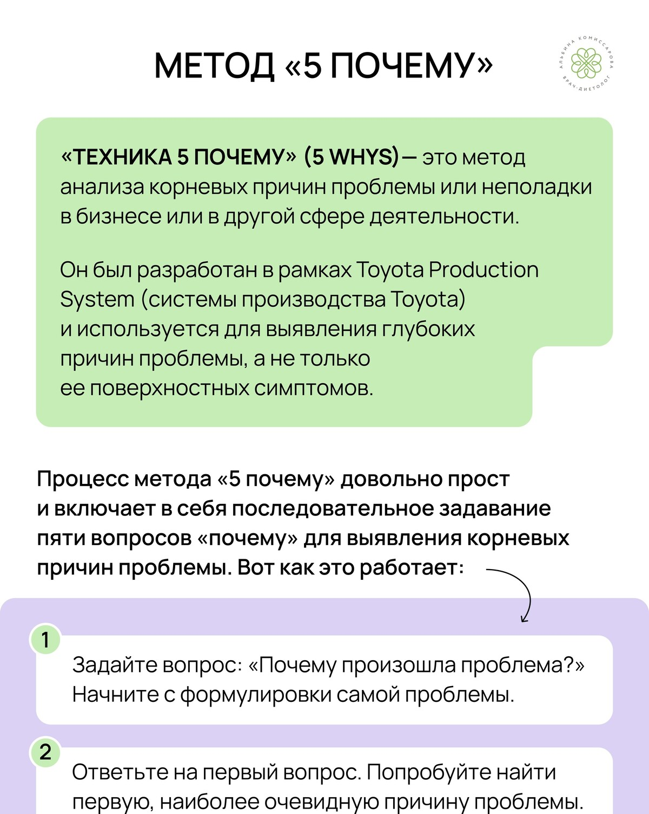
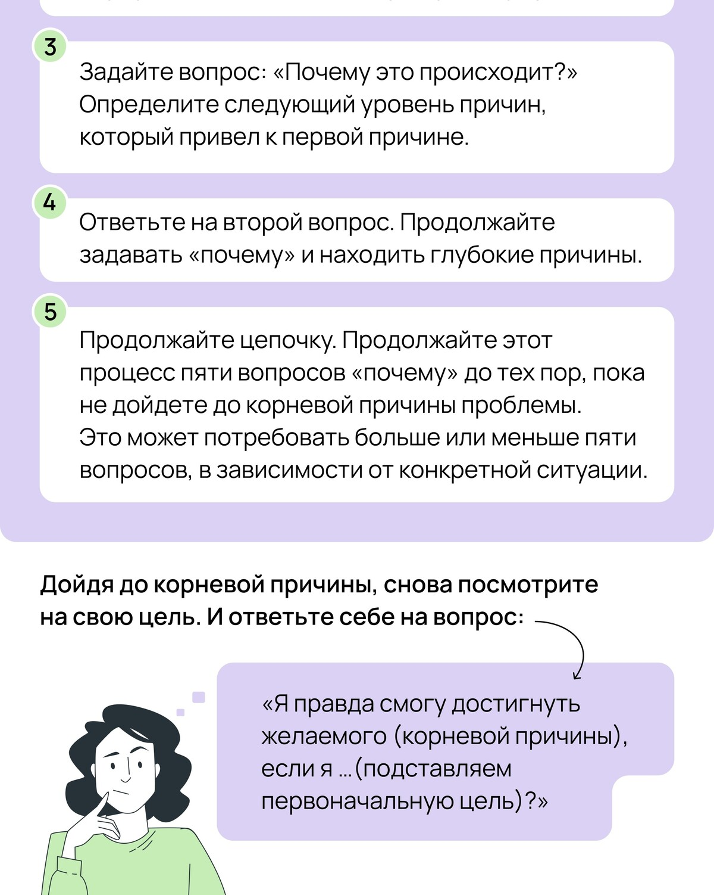
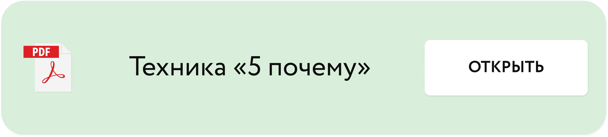

# Постановка цели

Автор: Кристина Живая - психолог проекта

## Материалы урока

[Видео 01.mp4](Видео%2001.mp4)

Тайм-код

00:00 Приветствие и знакомство

02:25 Постановка цели

05:11 “На что я могу повлиять?” Круг контроля.

11:26 Основные ошибки при постановке цели. Модель VAPID.

17:37 Упражнение “5 зачем?”

## Исходная страница

https://school.doctor-akomissarova.ru/pl/teach/control/lesson/view?id=339809418&editMode=0
