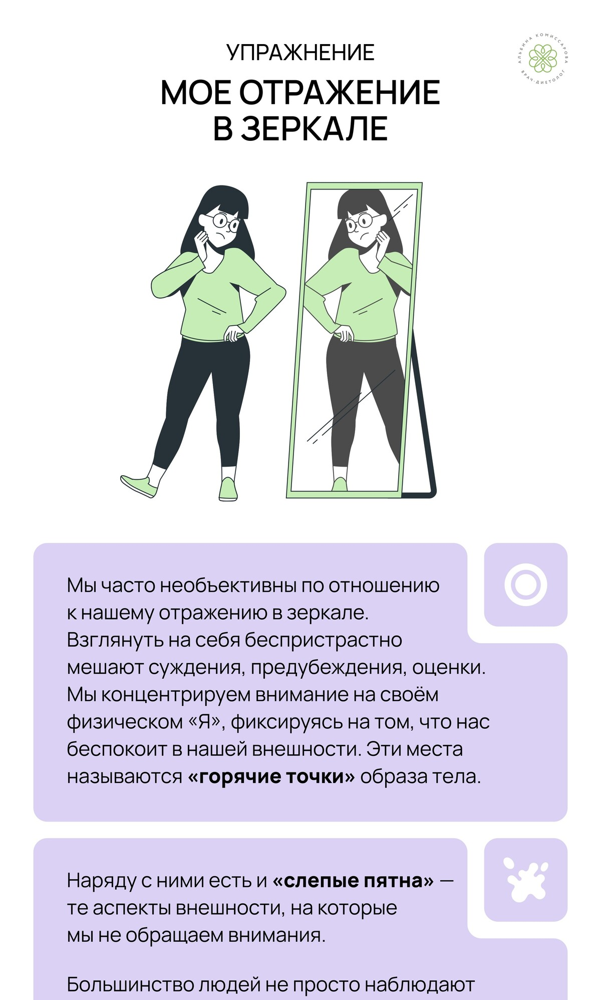
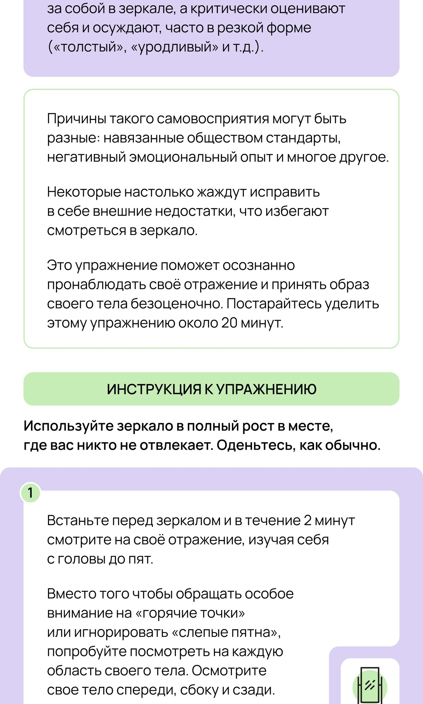
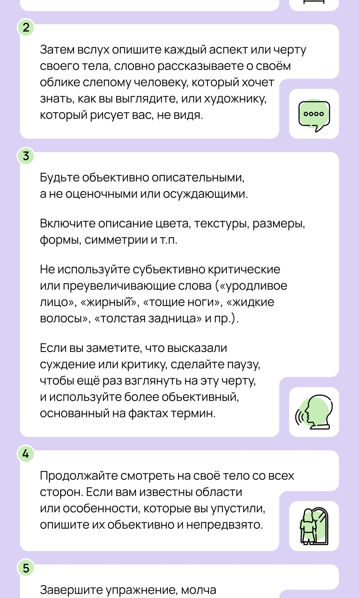
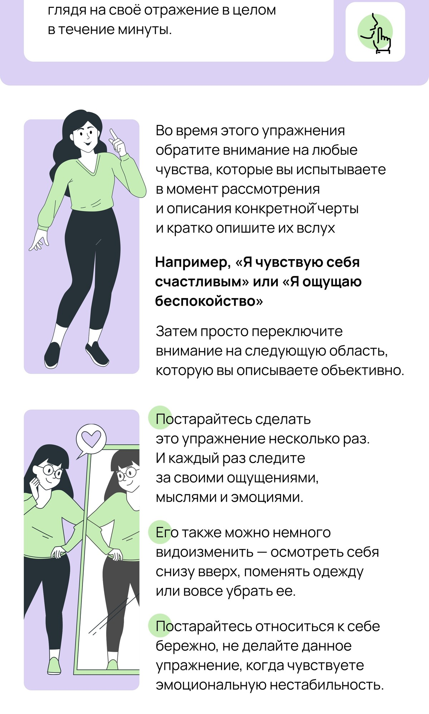
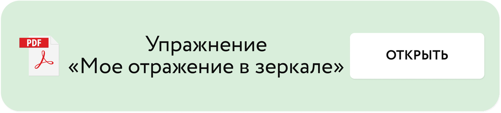
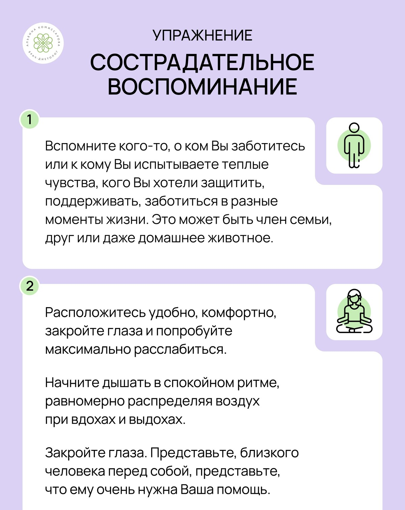
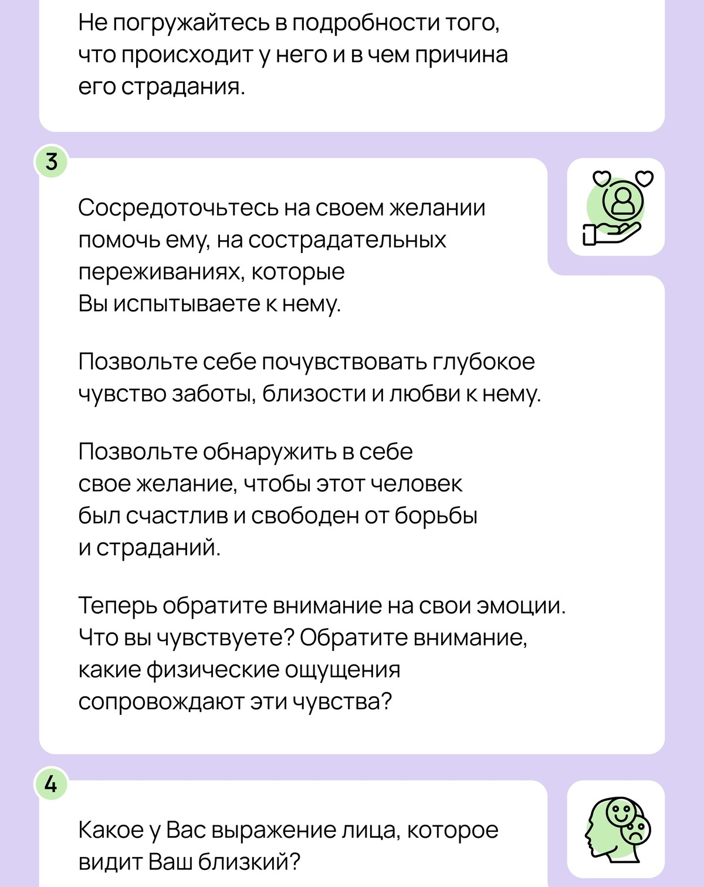
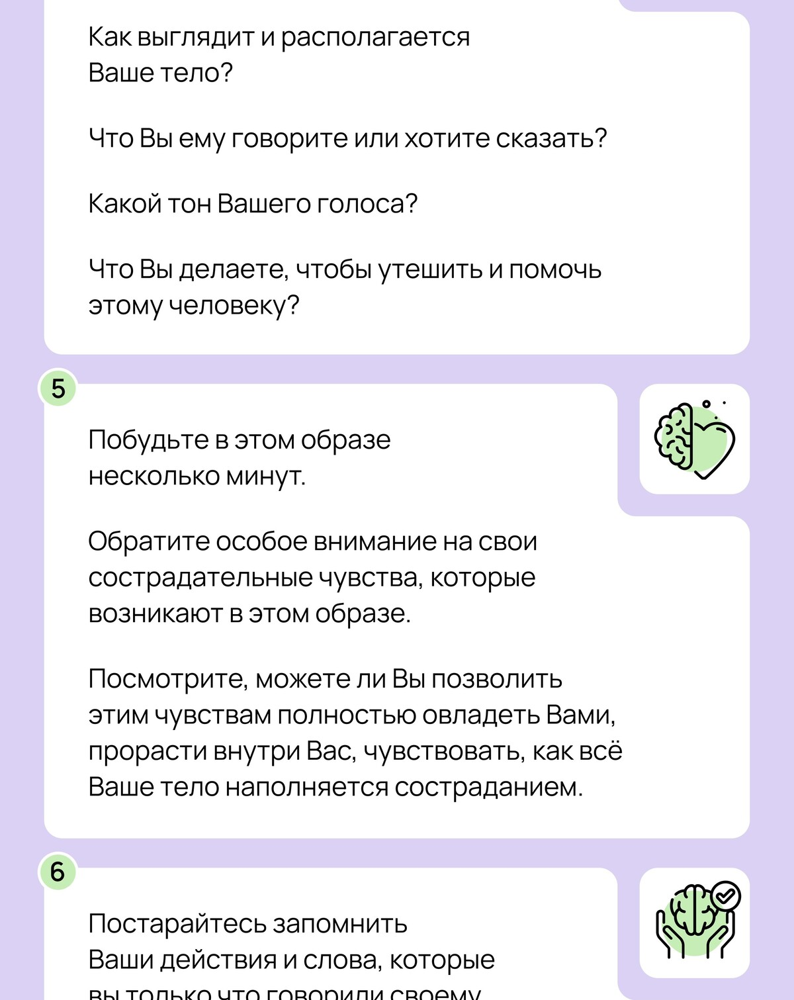
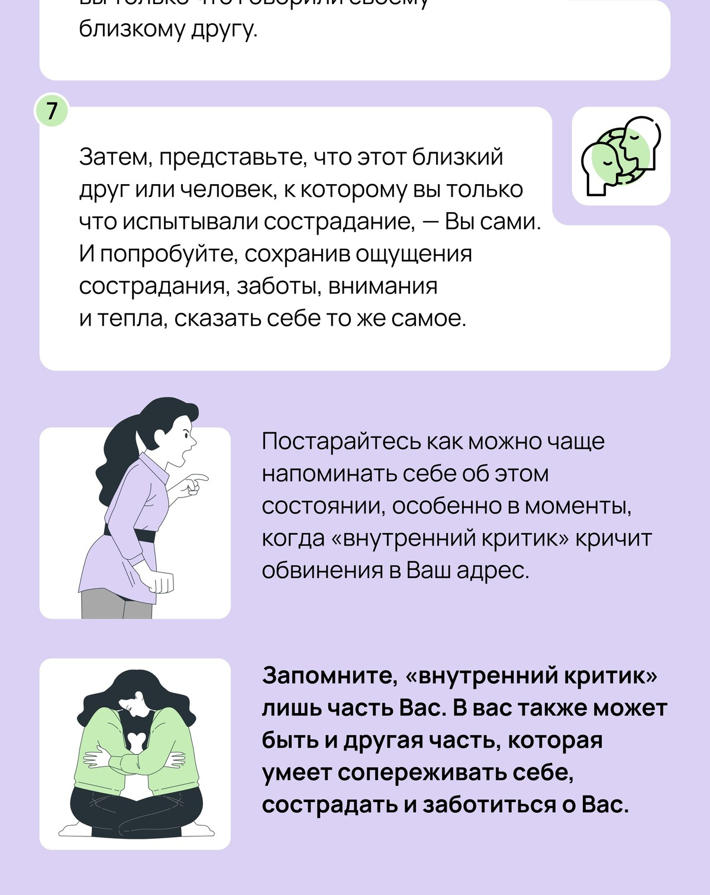
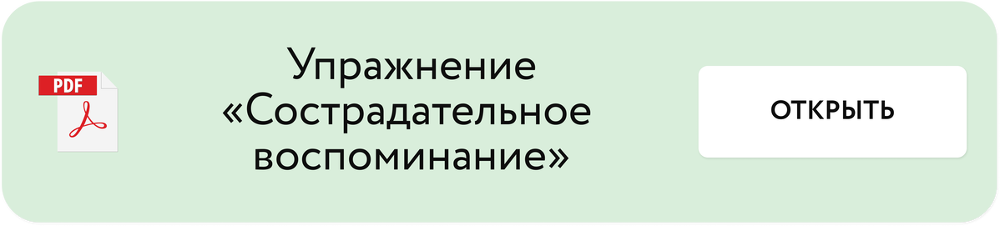

# Внутренний критик

Автор: Кристина Живая - психолог проекта

## Материалы урока

[Видео 01.mp4](Видео%2001.mp4)

Тайм-код

00:00 Приветствие

01:48 В чем отличие вины и стыда?

03:25 Работа со стыдом и самокритикой

14:20 Практика “Сострадательное воспоминание”

## Исходная страница

https://school.doctor-akomissarova.ru/pl/teach/control/lesson/view?id=339809419&editMode=0
