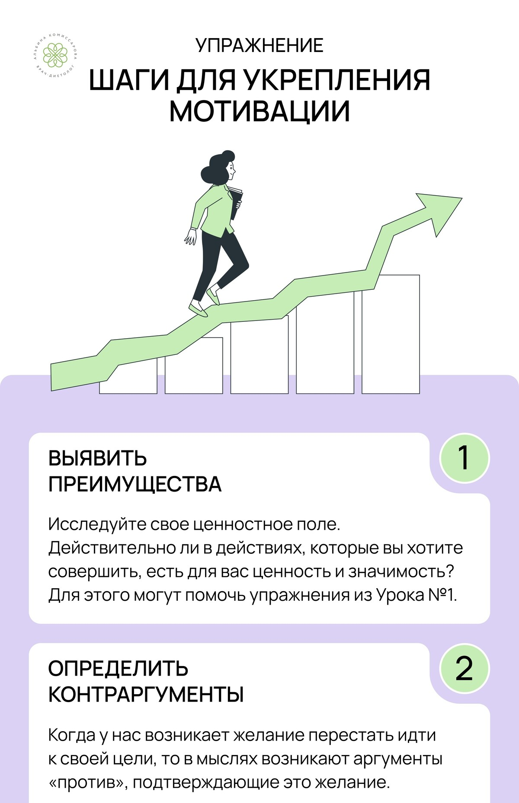
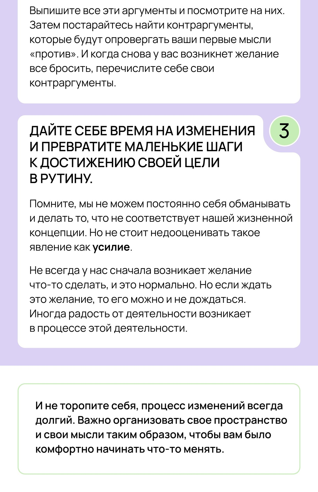
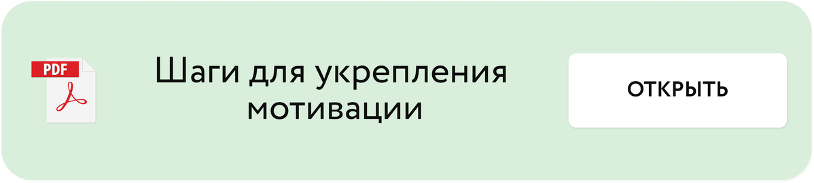

# Здоровая мотивация

Автор: Кристина Живая - психолог проекта

## Содержание

Тайм-код

00:00 Приветствие

00:49 Мифы о мотивации

11:20 Вопрос вам от психолога

12:54 Что поможет дойти до конца?

## Видео

- Видео 01.mp4 — 27:02

## Изображения

## Исходная страница

https://school.doctor-akomissarova.ru/pl/teach/control/lesson/view?id=339809420&editMode=0
