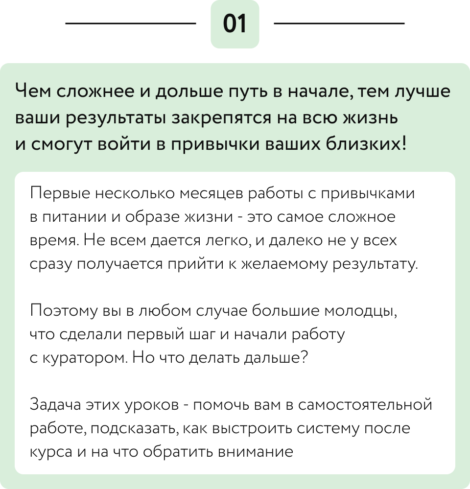
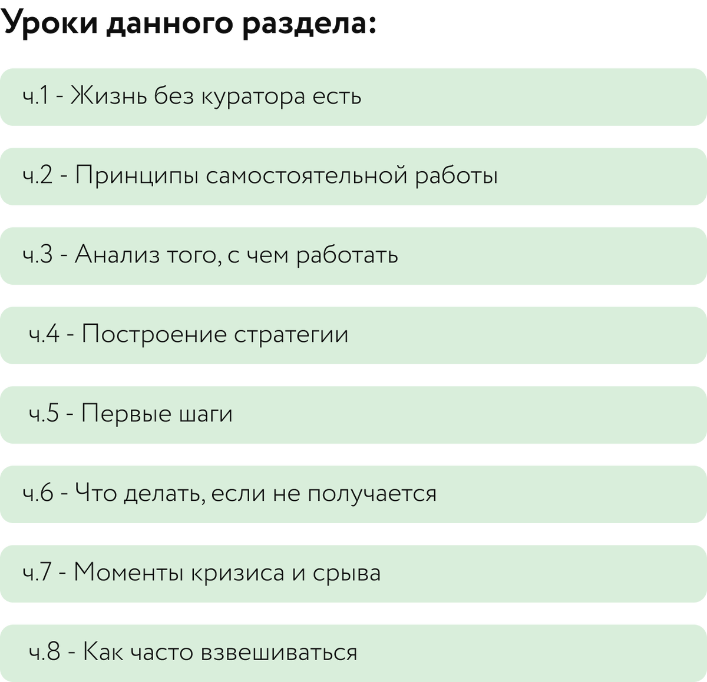

# 8 уроков для самостоятельной работы

## Материалы урока

ч.1 - Жизнь без куратора есть

[Видео 01.mp4](Видео%2001.mp4)

ч.2 - Принципы самостоятельной работы

[Видео 02.mp4](Видео%2002.mp4)

ч.3 - Анализ того с чем работать

[Видео 03.mp4](Видео%2003.mp4)

ч.4 - Построение стратегии

[Видео 04.mp4](Видео%2004.mp4)

ч.5 - Первые шаги

[Видео 05.mp4](Видео%2005.mp4)

ч.6 - Что делать если не получается

[Видео 06.mp4](Видео%2006.mp4)

ч.7 - Моменты кризиса и срыва

[Видео 07.mp4](Видео%2007.mp4)

ч.8 - Как часто взвешиваться и послесловие

[Видео 08.mp4](Видео%2008.mp4)

## Исходная страница

https://school.doctor-akomissarova.ru/pl/teach/control/lesson/view?id=340013840&editMode=0
